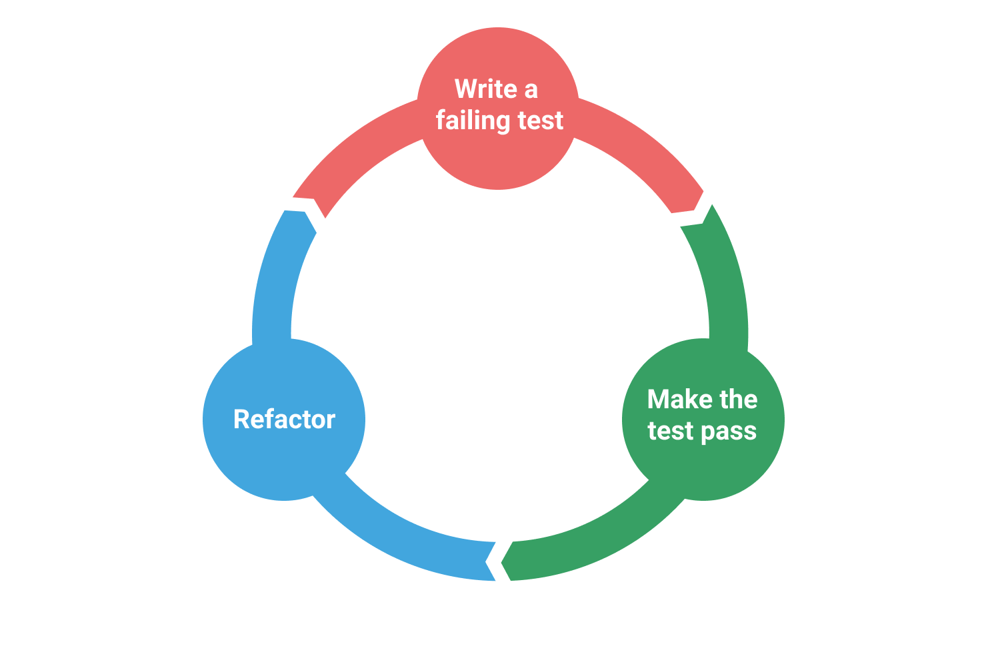
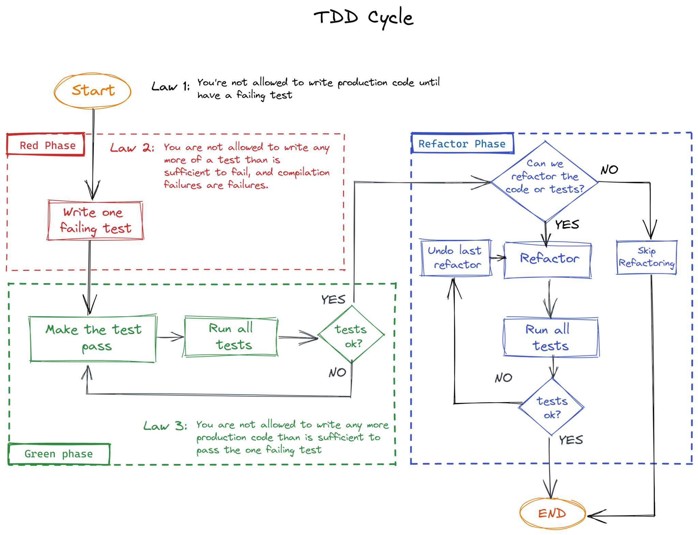

# TDD Exercises in Java

TDD exercises taken from [TDD Manifesto](https://tddmanifesto.com/exercises/).

## Purpose and methodolody
The purpose of this repository is to serve as didactic example of the TDD process
(at least one possible solution) following the theoretical cycle as strictly as
possible.



Every stage of the cycle will be followed taking into account the 3 laws, as in
the following diagram:



## Branching strategy
Branches are organized by kata (FizzBuzz, String calculator, etc.) and commits
by requirements and TDD steps (red-green-refactor).

### Commit examples

#### First step: red test
```
FizzBuzz - Red: Added method signature

Added fizzBuzz() signature 
```

#### Second step: green test
```
FizzBuzz - Green: Added method signature

Added fizzBuzz() signature 
```

#### Third step: refactor (if apply)
```
FizzBuzz - Refactor: Added method signature

Added fizzBuzz() signature 
```


## Bibliography
Needless to say there is a lot of documentation, courses and tutorials available
about this subject. Here I'll be posting some resources I found useful while
doing some research for this repository
* [Test-Driven Development: What is TDD](https://tdd.mooc.fi/1-tdd): This is part
of a TDD course with proposed exercises in Typescript.This theory section and the
followings has a deep and good explaining about the technique, with links to very
good external resources.
* [Wikipedia: Test-driven development](https://en.wikipedia.org/wiki/Test-driven_development):
Wikipedia entry about TDD. Contains several useful references to study TDD.
* [How to TDD a List Implementation in Java](https://www.baeldung.com/java-test-driven-list):
Example on how to write a custom implementation for `List<E>` using TDD
